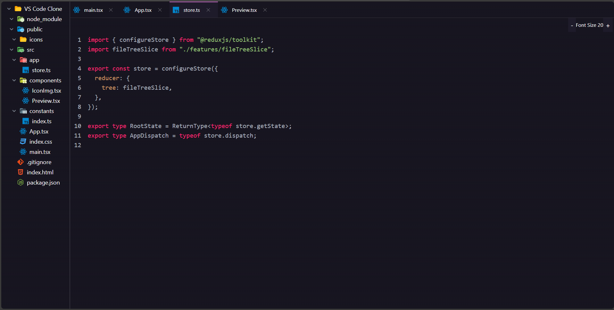

# 🧩 VS Code UI Clone

A modern and interactive clone of the Visual Studio Code interface built using **React**, **TypeScript**, and **Tailwind CSS**. This project replicates the core layout and experience of VS Code, complete with resizable panels, editor tabs, and syntax-highlighted code blocks.

---

## 🚀 Tech Stack

- **React** – UI library
- **TypeScript** – Type-safe JavaScript
- **Tailwind CSS** – Utility-first CSS framework
- **React-Redux** – State management
- **React-resizable-panels** – Drag-to-resize UI panels
- **React-syntax-highlighter** – Code syntax highlighting

---

## ✨ Features

- 🧱 **Resizable Panels** – Fully adjustable sidebar, editor, and preview areas  
- 🗂️ **Tab System** – Manage open files/tabs like real VS Code  
- 🖍️ **Code Highlighting** – Beautiful, language-aware syntax themes  
- ⚡ **Redux Integration** – Persistent UI state handling  
- 🛠  **ReSize the Font** - Controls The Font Size
- 🎨 **Responsive Design** – Works across screen sizes  

---

## 📸 Preview

---

## 🚀 Live Demo

[🔗 View Live Demo](https://vscode-ui-clone.netlify.app)